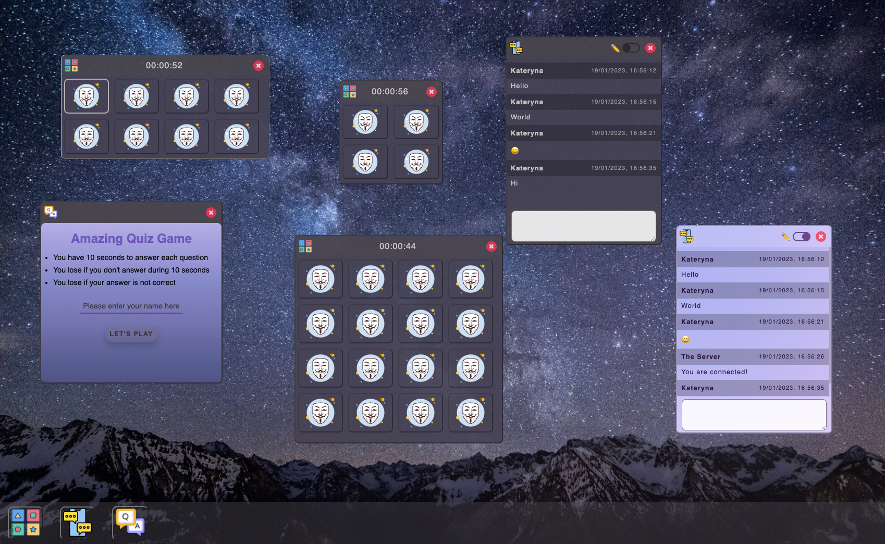

# personal-desktop-spa
"Personal Web Desktop" (PWD) single-page application that provides functionality to launch and interact with multiple windows of such applets as Memory Game, Chat and Quiz.  

Part of the university web development course. Completed in January 2023.




Link to the presentation video https://drive.google.com/file/d/1fBX1lutH5deUb7t3fXKWTV4co9HOzFut/view


## Download and Start PWD
1. Clone gitlab repository:
```console
git clone git@github.com:kmelnyk88/personal-desktop-spa.git
```
2. Navigate to folder personal-desktop-spa

```console
cd personal-desktop-spa
```

3. Install node dependencies (including Vite):
```console
npm install
```

4. Serve the  files from dist at http://localhost:4173

```console
npm run serve
```